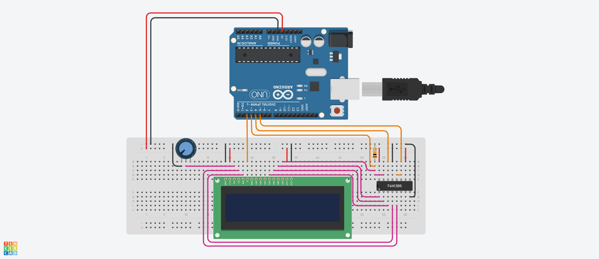

# ShiftLcd Library for Arduino

This Arduino library provides an easy-to-use interface for controlling an HD44780U (or similar) LCD display with a SN74HC595 (or similar) shift register. It can control the display with only four pins from the Arduino. 

## Table of Contents

- [Features](#features)
- [Wiring](#wiring)
- [Installation](#installation)
- [Usage](#usage)
- [Interface](#interface)

## Features

- Display text on an LCD screen.
- Scroll text left or right with customizable delays.
- Blink the display with a specified blink rate.
- Clear the display for a clean slate.
- See the interface section for all features.

## Wiring

1. Connect everything according to the picture:

  * The pull down resistor connected to the LCDs D7-pin should be ca 10 kOhms.
  * The 10 kOhms potentiometer connected to the LCDs V0-pin can be replaced by a ca 5 kOhms resistor.

## Installation

Installation can be done either from the Arduino IDE or from the source code.

#### Arduino IDE:
1. Go to: Sketch > Include Library > Manage Libraries.
2. Search after "ShiftLcd".
3. Click install.


#### From source:
1. Clone the repository to your projects directory.
```bash
  cd <directoryOfProject>
  git clone https://github.com/eb1992/ShiftLcd
```   

2. Import the library via relative path instead:
```cpp
#include "ShiftLcd/src/ShiftLcd.h"

```

## Usage

1. Include the `ShiftLcd` library in your Arduino sketch and create an instance of it:

```cpp
  #include <ShiftLcd.h>

  int LCD_EN = 2;
  int LCD_D7 = 3; 
  int SHIFT_SER = 4; 
  int SHIFT_SRCLK = 5;

  ShiftLcd lcd(LCD_EN, LCD_D7, SHIFT_SER, SHIFT_SRCLK);
```
2. Initialize the LCD in the setup() function and write a message:

```cpp
  void setup() {
    lcd.begin();
    lcd.write("Hello, World!");
  }
```
3. Use the library functions to control the LCD in the loop() function:

```cpp
  void loop() {
    lcd.scrollLeft();
  }
```

## Interface
Constructor. Initializes the LCD with specified pin numbers:
```cpp
  ShiftLcd(int LCD_EN, int LCD_D7, int SHIFT_SER, int SHIFT_SRCLK);
```
#### Methods for LCD control
Initialize the LCD:
```cpp
  void begin();  
```

Turn on the LCD:
```cpp
  void on();     
```

Turn off the LCD:
```cpp
  void off();    
```

Shift the display text one step to the left:
```cpp
  void shiftLeft();   
```

Shift the display text one step to the right:
```cpp
  void shiftRight();  
```

Scroll text to the right:
```cpp
  void scrollRight(unsigned long delay);  
```

Scroll text to the right with the default time:
```cpp
  void scrollRight();                     
```

Scroll text to the left:
```cpp
  void scrollLeft(unsigned long delay);   
```

Scroll text to the left with the default time:
```cpp
  void scrollLeft();                      
```

Blink the display:
```cpp
  void blink(unsigned long delay);       
```

Blink the display with the default time:
```cpp
  void blink();                           
```

Clear the LCD display:
```cpp
  void clear();                           
```

#### Methods for writing to the LCD
Write a character array:
```cpp
  void write(char msg[]);                   
```

Write two character arrays to the two rows of the display:
```cpp
  void write(char msg1[], char msg2[]);      
```

Write a character array and an integer to the two rows of the display:
```cpp
  void write(char msg[], int n);            
```

Write an integer:
```cpp
  void write(int n);                        
```

Write a String:
```cpp
  void write(String msg);                   
```

Write two Strings to the two rows of the display:
```cpp
  void write(String msg1, String msg2);     
```

Write a String and an integer to the two rows of the display:
```cpp
  void write(String msg, int n);            
```
